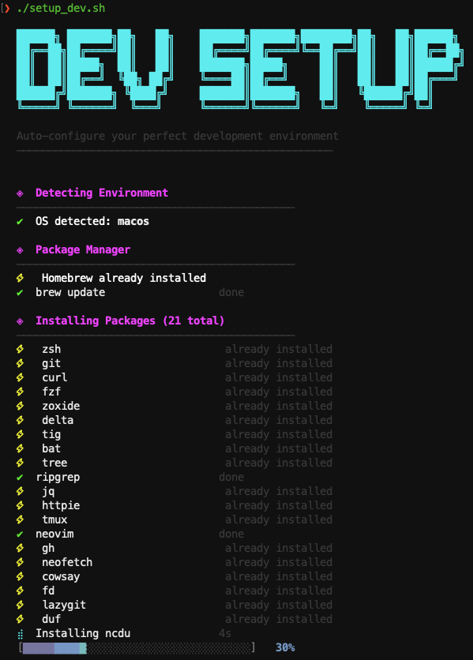

# ⚡ dev-setup

One command to set up your entire development environment on macOS or Linux.

Installs 20+ essential CLI tools, configures Zsh with Oh My Zsh + Powerlevel10k, sets up nvm + Node.js LTS, and wires everything into your `.zshrc` — with a polished terminal UI that shows per-package progress bars as it goes.

```bash
bash <(curl -fsSL https://raw.githubusercontent.com/s1031432/dev-setup/main/setup.sh)
```

---

## Demo



---

## What Gets Installed

### CLI Tools (via Homebrew / apt / dnf / pacman / zypper)

| Tool | Description |
|------|-------------|
| `zsh` | Modern shell |
| `git` | Version control |
| `curl` | HTTP client |
| `fzf` | Fuzzy finder |
| `zoxide` | Smarter `cd` |
| `delta` | Better git diffs |
| `tig` | Git TUI |
| `bat` | `cat` with syntax highlighting |
| `tree` | Directory listing |
| `ripgrep` | Blazing fast `grep` |
| `jq` | JSON processor |
| `httpie` | Friendly HTTP client |
| `tmux` | Terminal multiplexer |
| `neovim` | Modern Vim |
| `gh` | GitHub CLI |
| `neofetch` | System info |
| `cowsay` | Fun terminal messages |
| `fd` | User-friendly `find` |
| `lazygit` | Git TUI (interactive) |
| `duf` | Disk usage (modern `df`) |
| `ncdu` | Disk usage analyzer |
| `eza` | Modern `ls` replacement |

### Frameworks & Themes

| Component | Description |
|-----------|-------------|
| **Oh My Zsh** | Zsh framework |
| **Powerlevel10k** | Fast, customizable Zsh theme |
| **zsh-autosuggestions** | Fish-like autosuggestions |
| **zsh-syntax-highlighting** | Command syntax highlighting |

### Runtime Managers

| Tool | Description |
|------|-------------|
| **nvm** | Node Version Manager (v0.40.1) |
| **Node.js LTS** | Installed automatically via nvm |

### Shell Configuration

The script auto-configures `~/.zshrc` with:

- Powerlevel10k as the default theme
- Autosuggestions + syntax highlighting plugins
- fzf keybindings
- zoxide (`z` / `j` for quick directory jumping)
- nvm lazy-loading
- A welcome greeting (cowsay + neofetch)

A backup is saved to `~/.zshrc.bak-devsetup` before any changes.

---

## Requirements

- **macOS** (with or without Homebrew — it will be installed if missing)
- **Linux** (Ubuntu/Debian, Fedora, Arch, openSUSE — any distro with `apt`, `dnf`, `yum`, `pacman`, or `zypper`)
- **bash ≥ 4** (pre-installed on all supported systems)
- A terminal emulator with Unicode + 256-color support (virtually all modern terminals)

---

## Usage

### Quick Install (recommended)

```bash
bash <(curl -fsSL https://raw.githubusercontent.com/s1031432/dev-setup/main/setup.sh)
```

### Clone & Run

```bash
git clone https://github.com/s1031432/dev-setup.git
cd dev-setup
chmod +x setup.sh
./setup.sh
```

### After Installation

Restart your terminal, or:

```bash
source ~/.zshrc
```

On first launch with Powerlevel10k, you'll get an interactive configuration wizard — follow the prompts to pick your preferred style.

---

## Customization

### Adding or Removing Packages

Edit the `pkgs` array near line 386 of `setup.sh`:

```bash
pkgs=(zsh git curl fzf zoxide delta tig bat tree ripgrep jq httpie tmux neovim gh neofetch cowsay fd lazygit duf ncdu)
```

Add any package available in your system's package manager. The script handles detection and skipping automatically.

### Skipping Sections

Each section is independent. Comment out any `print_section` + its block to skip it entirely (e.g., Oh My Zsh, Powerlevel10k, nvm).

---

## Uninstalling

The script doesn't provide an uninstall command, but everything it does is reversible:

1. Restore your original shell config: `cp ~/.zshrc.bak-devsetup ~/.zshrc`
2. Remove Oh My Zsh: `rm -rf ~/.oh-my-zsh`
3. Remove nvm: `rm -rf ~/.nvm`
4. Uninstall packages via your package manager (`brew uninstall`, `apt remove`, etc.)

---

## Contributing

Contributions are welcome! Feel free to open an issue or submit a pull request.

1. Fork the repository
2. Create your feature branch (`git checkout -b feature/add-tool`)
3. Commit your changes (`git commit -m 'Add new tool'`)
4. Push to the branch (`git push origin feature/add-tool`)
5. Open a Pull Request

---

## License

[MIT](./LICENSE)
